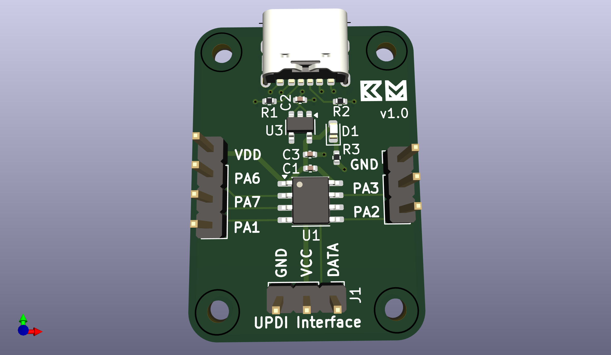
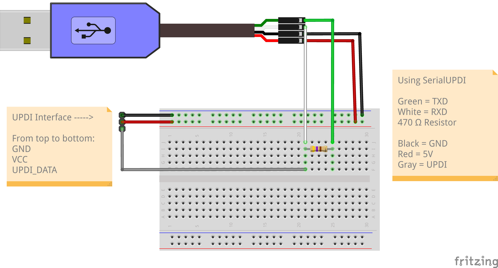
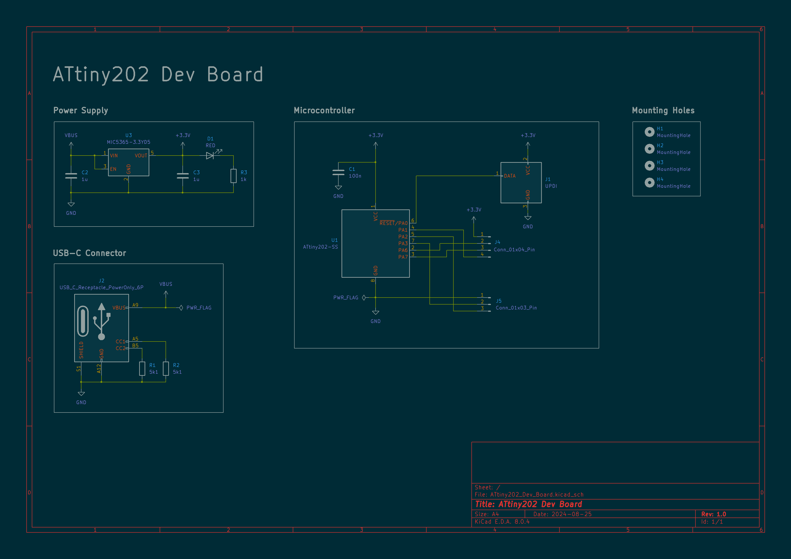
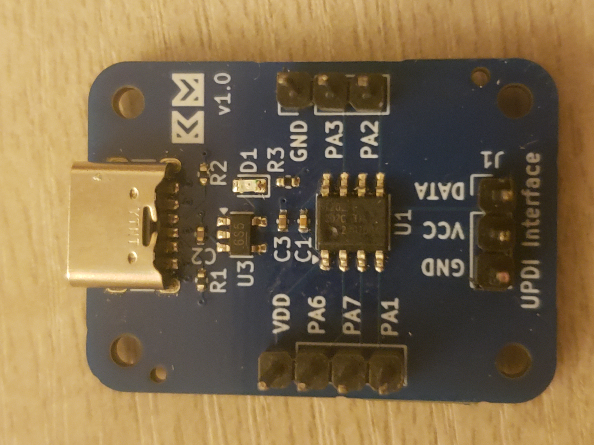
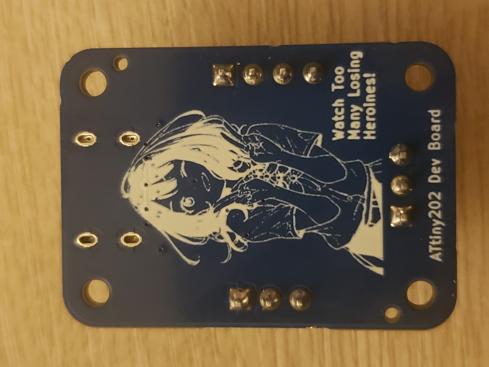

# ATtiny202 Dev Board

A small development board for the ATtiny202 microcontroller and my first PCB!



## Features


- Power-Only USB Type-C Receptacle
- 3.3V LDO Voltage Regulator
- Red Power On LED Indicator
- UPDI Interface

## Programming

Programmable using [SerialUPDI](https://github.com/SpenceKonde/AVR-Guidance/blob/master/UPDI/jtag2updi.md) (recommended)
or [jtag2updi](https://github.com/ElTangas/jtag2updi).



Install avrdude following these [instructions](https://github.com/avrdudes/avrdude/wiki/Building-AVRDUDE-for-Linux) on their GitHub. Don't install through your system's package manager, or you'll get an older version of avrdude that doesn't have SerialUPDI. 

After you've built your project and connected the USB to TTL adapter to your PC and the UPDI interface, 
you can now upload the program using avrdude

```
avrdude -vvv -c serialupdi -b 230400 -P /dev/ttyUSB0 -p t202 -U flash:w:your_build_file.hex:a
```

Breaking it down (better explanation at [avrdude docs](https://avrdudes.github.io/avrdude/8.0/avrdude_4.html#Option-Descriptions)):
- `-vvv` Enables verbose output
- `-c` Specifies the programmer to be used
- `-b` Sets the baud rate
- `-P` Selects which port to use
- `-p` Says which microcontroller we're programming for (t202 stands for ATtiny202). You can view the list of parts supported at [D. List of Parts](https://avrdudes.github.io/avrdude/8.0/avrdude_45.html#List-of-Parts)
- `-U` Write the hex file to flash memory and auto-detect the file format (usually Intel Hex)

## Schematic



## Manufacturing/Assembly

JLCPCB formatted BOM, CPL, and Gerber files can be found in [hardware](/hardware).

Here's how the fully assembled PCB looks.

Top             |  Bottom
:-------------------------:|:-------------------------:
 | 
